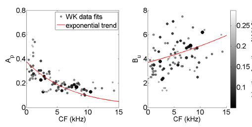
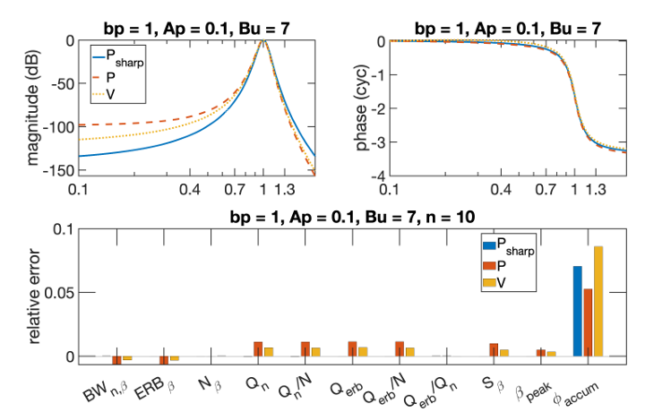
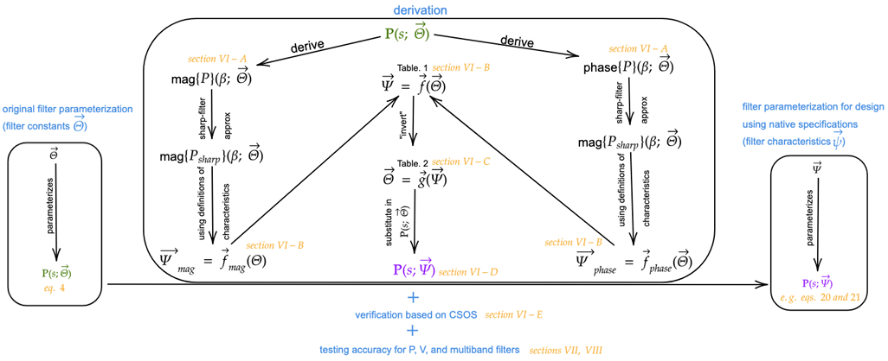

# GEFs
The toolbox has been primarily developed for filter design and signal processing and analysis purposes abd it can be used for various applications such as the scientific study of the auditory system pertaining to the cochlea and perceptual studies. The toolbox has been developed such that users with interests and backgrounds in only one of the aforementioned fields may use it without concerning themselves with other functionalities.

## Capabilities for Filter Design and Filtering
This toolset includes functionalities for filter construction and signal processing using filters for arbitrary filters and signals. It also includes filter design functionalities specific to a class of bandpass filters (referred to as GEFs) and related classes of bandpass filters, multiband filters, and filterbanks. GEFs are bandpass LTI filters with a pair of poles repeated $B_u$ times.

## General Filters and Signals
More details are provided later as well as in the documentation, but in summary, the available functionalities are
* Arbitrary filters may be constructed from poles and zeros or from a transfer function.
* Parameterized filters may be constructed using the parameterized model in [1] as well as user-inputted constants.
* Multiband filters can be constructed by providing lists of constants or filter characteristics.
* Filterbanks can be constructed by inputting lists of constants or filter characteristics *or* filters. Arbitrary topologies can be implemented, but default options for parallel and series are providd.
* Signals are treated as distinct objects and can be fed into filters/filterbanks.
* Everything has various plotting options, especially base filters and signals.

## Design of GEFs
* GEFs, also known as Generalized Auditory Filters (GAFs), allow filter design throguh specifying filter characeristics such as peak frequencies, quality factors, and group delays. This is as opposed to filter design based on the complex frequency response or its magnitudes or amplitude over a length of frequencies. This can be extended to filterbanks
* Though transfer functions frequently have integer orders, GEFs can be have rational exponents, better approximating a continuum of filter characteristics and allowing for finer control of said characteristics.

## Tutorials and Documentation
* Documentation for the toolbox is in `documentation.pdf`. Example Python plots in the documentation are generated using `GEFs_alkhairy.py`, along with some additional computational examples. Uncomment the ones as needed to demonstrate capabilities, e.g. `outputsignal_autocorrelates()`, `outputsignal_correlate_with()`, and `outputsignals_correlogram()` together show various correlation plots involving the output signals from a filterbank. Similar, the example MATLAB plots in the documentation and some additional computations are in `GEFs_alkhairy.m`. These tests illustrate a comprehensive set of the toolbox's capabilities.
* `plot_tutorial.py`, `alkhairy2024.m`, and `alkhairy2024rat.m` generate some of the figures in [3] and [4] and are of the greatest interest to those in signal processing and filter design.

## Requirements for Running the Toolbox

### 1. Python Environment
The toolbox may be used in Python or MATLAB. In either case, you will need to install **Python 3.12** **[[Link]](https://www.python.org/downloads/release/python-3128/)**.
This can be done globally or using a virtual environment - e.g. [see here](https://dev.to/emminex/how-to-install-python-libraries-in-visual-studio-code-38i1).

### 2. Installing Refactoring Branch of GEFs Toolbox

#### 2.1. Installation via Python Via Terminal (PowerShell/PyCharm)
For users working in Python, it is highly recommended to run these commands via Terminal (PowerShell/PyCharm):

```
pip install setuptools wheel
pip install --no-build-isolation git+https://github.com/AnalyticModeling/GEFs.git@Refactoring
```

#### 2.2. Installation via MATLAB (command Window)
To use the model's features within MATLAB, The GEFs toolbox Refactoring branch must be cloned :

```
!git clone -b Refactoring https://github.com/AnalyticModeling/GEFs.git
```

### 3. Libraries Installation
To install the necessary dependencies, navigate to the project folder and run the following command in your terminal:

```
$ pip install -r requirements.txt
```

## Contributing

please complete the following validation steps before submitting a pull request:

### Python Validation
The Python implementation includes a unit testing suite located in the `tests/` directory.
* **Run Unit Tests:** Execute all files within the `tests/` folder. Ensure the output for each test is "Passed" or as expected. 
    * *Note: There is currently one known minor test failure; please ensure your changes do not introduce any additional regressions.*
* **Run Demo:** Execute `demo_GEFs.py` to verify that the core model visualizations and functionalities remain intact.

### MATLAB Validation
please manually verify the MATLAB implementation to ensure changes do not break the logic:
* Run `alkhairy2024.m` and `alkhairy2024rat.m` to check for execution errors.
* **Run Demo:** Execute `demo_GEFs.m` and confirm the output matches the expected physiological behavior.


## Contributors
Wayne Zhao
Supervisor: Samiya Alkhairy

## References
[1] Alkhairy, S. A., & Shera, C. A. (2019). An analytic physically motivated model of the mammalian cochlea. The Journal of the Acoustical Society of America, 145(1), 45-60. [link](https://doi.org/10.1121/1.5084042).  
[2] Alkhairy, S. A. (2024, February). Cochlear wave propagation and dynamics in the human base and apex: Model-based estimates from noninvasive measurements. In AIP Conference Proceedings (Vol. 3062, No. 1). AIP Publishing. [link](https://doi.org/10.1063/5.0189264).   
[3] Alkhairy, S. A. (2024). Characteristics-Based Design of Multi-Exponent Bandpass Filters. arXiv preprint arXiv:2404.15321. [link](https://arxiv.org/abs/2404.15321v1).  
[4] Alkhairy, S. A. (2024). Rational-Exponent Filters with Applications to Generalized Auditory Filterbanks. arXiv preprint arXiv:2406.16877. [link](https://arxiv.org/abs/2406.16877v2).  
[5] Katsiamis, A. G., Drakakis, E. M., & Lyon, R. F. (2007). Practical gammatone-like filters for auditory processing. EURASIP Journal on Audio, Speech, and Music Processing, 2007, 1-15. [link](https://link.springer.com/article/10.1155/2007/63685).

# More Details

## More details on general filters and signals

### General Filters and Signals: Constructing Arbitrary Filters and Multiband Filters
* Arbitrary filters may be constructed - e.g. using provided poles and zeros or by provided a transfer function, then used for filtering any signal.
* Parameterized filters may also be constructed by specifying the resulting characteristics a filter is supposed to be have (e.g. bandwidth), and the program will estimate appropriate original constants.
* Multiband filters can be constructed from providing lists of constants/characteristics

### General Filters and Signals: Filtering
* A signal provided as a time-series or a frequency response may be inputted into a constructed or designed filter, filterbank, or multiband filter.
* The output signal may be generated by filtering the input signal using any of several solution methods with some specific to GEFs/GAFs and others that apply more generally.
<!-- 2024rat the spectogram -->

### General Filters and Signals: Signal Analysis and Plots
* The toolbox includes functionalities for any signal such as autocorrelation and envelope extraction.
* Filterbanks with constitutive filters - each with a different peak frequency, may be used to generate outputs. Plots include the envelope of the output signals as a function of time and peak frequency.

<p align="center">
  
  <br>
  <em>Figure 5 from paper [1].</em>
</p>

## More details on GEFs and their design motivations

### GEFs: Philosophy of Characteristics-Based Design of Classes of Bandpass Filters (e.g. GEFs)
* Designs certain classes of bandpass filters such as Generalized Exponent Filters (GEFs) also known as Generalized Auditory Filters (GAFs) based on simultaneous specifications on filter characteristics including peak frequencies, quality factors, and group delays. This is as opposed to filter design based on the complex frequency response or its magnitudes or amplitude over a length of frequencies.
* The characteristics-based design method is direct, non-iterative, highly-accurate for sharp filters, and allows for designing sharp filters with minimal delay.
* The characteristics-based design methods extends beyond GEFs to related bandpass filters (see [3]) as well as to filterbanks and bandpass filters and may be used for adaptive filtering based on variable filter design.
* The accuracy in achieving the desired specifications on filter characteristics is assessed.

<p align="center">
  
  <br>
  <em>Figure 5 from paper [3].</em>
</p>

### GEFs: Designing and Filtering with Rational Exponent Filters (Rational GEFs)
* In order to access a continuum of filter characteristics, GEFs may have rational exponents rather than being constraint to discrete filter behavior.
* The toolbox includes various solution methods for filtering using rational GEFs.

<p align="center">
  
  <br>
  <em>Figure 1 from paper [3].</em>
</p>

### GEFs: Potential Signal Processing Applications for GEFs
* Potential applications may benefit from the direct specification over desired characteristics as well as the fine control over the characteristics enabled by the rational exponents primarily include those that make use of bandpass filterbanks and multiband filters. Such applications may include: parameteric equalizers, a front end for speech processing, microseismic signal analysis, and signal classification. <!-- XXX INSERT.  -->

<!-- ### GEFs: Filters Related to GEFs
* Filters related to GEFs include the gammatone family of filters - e.g. Gammatone Filters (GTFs), All-Pole Gammatone Filters (APGFs), One-zero Gammatone Filters (OZGFs) [5] -->

### GEFs: Highlights for GEFs and Rational GEFs
* Allows for designing filters, filterbanks, and multiband filters by directly dictating or controling specifications on desired filter characteristics such as peak frequencies, quality factors and group delays.
* Enables accessing a continuum of behavior not classically achievable with integer-exponent or integer-order filters.
* Enables solving and filtering with rational-exponent filters
